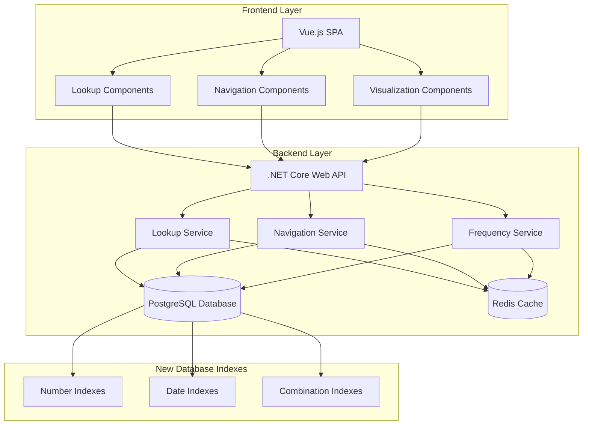

# Design Document

## Overview

The Lottery Lookup and Navigation feature extends the existing PredictLottoNZ system with comprehensive search, analysis, and navigation capabilities for historical lottery data. This feature introduces new user interface components, backend services, and database optimizations to enable efficient querying and browsing of lottery draw history. The design integrates seamlessly with the existing architecture while adding powerful analytical tools for users to explore patterns, frequencies, and historical trends in lottery data.

## Architecture

### System Architecture Integration



### Service Communication

- **Frontend to Backend**: RESTful HTTP API calls with JSON payloads for search queries and navigation requests
- **Backend to Database**: Optimized Entity Framework Core queries with custom indexes for fast lookups
- **Backend to Cache**: Redis integration for frequently accessed lookup results and navigation state
- **Real-time Updates**: SignalR for live search suggestions and auto-completion

## Components and Interfaces

### Frontend Components (Vue.js)

#### New Lookup Components
```typescript
// NumberLookup.vue - Single and multi-number search interface
interface NumberLookupProps {
  initialNumbers?: number[];
  maxNumbers?: number;
  showFrequencyData?: boolean;
}

// CombinationSearch.vue - Search for number combinations
interface CombinationSearchProps {
  maxCombinationSize?: number;
  showPartialMatches?: boolean;
  highlightMatches?: boolean;
}

// FrequencyAnalysis.vue - Range-based frequency analysis
interface FrequencyAnalysisProps {
  defaultRanges?: NumberRange[];
  showComparisons?: boolean;
  visualizationType?: 'chart' | 'heatmap' | 'table';
}

// DrawNavigation.vue - Previous/Next navigation controls
interface DrawNavigationProps {
  currentDraw?: LottoDraw;
  showPosition?: boolean;
  enableJumpTo?: boolean;
}

// SearchSuggestions.vue - Auto-completion and suggestions
interface SearchSuggestionsProps {
  searchType: 'number' | 'combination' | 'range';
  maxSuggestions?: number;
  showPreview?: boolean;
}
```

#### Enhanced Visualization Components
```typescript
// FrequencyChart.vue - Interactive frequency visualizations
interface FrequencyChartProps {
  data: FrequencyData[];
  chartType: 'bar' | 'line' | 'heatmap';
  interactive?: boolean;
  exportEnabled?: boolean;
}

// NumberHeatmap.vue - Visual representation of number frequencies
interface NumberHeatmapProps {
  frequencyData: NumberFrequency[];
  colorScheme?: 'hot-cold' | 'gradient' | 'discrete';
  showLabels?: boolean;
}

// TimelineChart.vue - Historical pattern visualization
interface TimelineChartProps {
  timelineData: TimelinePoint[];
  dateRange?: DateRange;
  zoomEnabled?: boolean;
}
```

### Backend Services (.NET Core)

#### New Service Interfaces
```csharp
public interface INumberLookupService
{
    Task<IEnumerable<NumberOccurrence>> LookupNumberAsync(int number);
    Task<IEnumerable<NumberOccurrence>> LookupNumbersAsync(int[] numbers);
    Task<CombinationSearchResult> SearchCombinationAsync(int[] combination, bool includePartialMatches = true);
    Task<IEnumerable<SearchSuggestion>> GetSearchSuggestionsAsync(string query, SearchType type);
}

public interface IFrequencyAnalysisService
{
    Task<IEnumerable<NumberFrequency>> GetNumberFrequenciesAsync();
    Task<IEnumerable<RangeFrequency>> GetRangeFrequenciesAsync(IEnumerable<NumberRange> ranges);
    Task<FrequencyComparison> CompareFrequenciesAsync(FrequencyComparisonRequest request);
    Task<IEnumerable<HotColdNumber>> GetHotColdAnalysisAsync(int periodDays = 365);
}

public interface IDrawNavigationService
{
    Task<LottoDraw> GetDrawByNumberAsync(int drawNumber);
    Task<LottoDraw> GetDrawByDateAsync(DateTime date);
    Task<LottoDraw> GetPreviousDrawAsync(int currentDrawNumber);
    Task<LottoDraw> GetNextDrawAsync(int currentDrawNumber);
    Task<NavigationContext> GetNavigationContextAsync(int drawNumber);
    Task<IEnumerable<LottoDraw>> GetDrawsInRangeAsync(DateTime startDate, DateTime endDate);
}

public interface IBookmarkService
{
    Task<Bookmark> CreateBookmarkAsync(int drawNumber, string label, string userId);
    Task<IEnumerable<Bookmark>> GetUserBookmarksAsync(string userId);
    Task<bool> DeleteBookmarkAsync(int bookmarkId, string userId);
    Task<Bookmark> UpdateBookmarkAsync(int bookmarkId, string newLabel, string userId);
}

public interface IExportService
{
    Task<byte[]> ExportLookupResultsAsync(LookupExportRequest request);
    Task<byte[]> ExportFrequencyDataAsync(FrequencyExportRequest request);
    Task<byte[]> ExportNavigationHistoryAsync(NavigationExportRequest request);
    Task<ExportStatus> GetExportStatusAsync(string exportId);
}
```

### Database Schema Extensions

#### New Tables for Lookup and Navigation
```csharp
[Table("NumberOccurrences")]
public class NumberOccurrence
{
    public int Id { get; set; }
    public int DrawNumber { get; set; }
    public int Number { get; set; }
    public int Position { get; set; } // 1-6 for main numbers, 7 for bonus, 8 for powerball
    public DateTime DrawDate { get; set; }
    public bool IsBonus { get; set; }
    public bool IsPowerball { get; set; }
    
    public virtual LottoDraw Draw { get; set; }
}

[Table("NumberFrequencies")]
public class NumberFrequency
{
    public int Id { get; set; }
    public int Number { get; set; }
    public int TotalOccurrences { get; set; }
    public DateTime LastAppearance { get; set; }
    public DateTime FirstAppearance { get; set; }
    public int LongestGap { get; set; }
    public double AverageFrequency { get; set; }
    public DateTime LastCalculated { get; set; }
}

[Table("Bookmarks")]
public class Bookmark
{
    public int Id { get; set; }
    public string UserId { get; set; }
    public int DrawNumber { get; set; }
    public string Label { get; set; }
    public string Description { get; set; }
    public DateTime CreatedAt { get; set; }
    public DateTime? UpdatedAt { get; set; }
    
    public virtual LottoDraw Draw { get; set; }
}

[Table("SearchHistory")]
public class SearchHistory
{
    public int Id { get; set; }
    public string UserId { get; set; }
    public string SearchType { get; set; }
    public string SearchCriteria { get; set; }
    public int ResultCount { get; set; }
    public DateTime SearchedAt { get; set; }
    public TimeSpan ExecutionTime { get; set; }
}

[Table("ExportJobs")]
public class ExportJob
{
    public int Id { get; set; }
    public string ExportId { get; set; }
    public string UserId { get; set; }
    public string ExportType { get; set; }
    public string Parameters { get; set; }
    public string Status { get; set; }
    public DateTime CreatedAt { get; set; }
    public DateTime? CompletedAt { get; set; }
    public string FilePath { get; set; }
    public string ErrorMessage { get; set; }
}
```

#### Database Indexes for Performance
```sql
-- Indexes for fast number lookups
CREATE INDEX IX_LottoDraws_WinningNumbers ON LottoDraws (WinningNumber1, WinningNumber2, WinningNumber3, WinningNumber4, WinningNumber5, WinningNumber6);
CREATE INDEX IX_LottoDraws_Date ON LottoDraws (Date);
CREATE INDEX IX_LottoDraws_Draw ON LottoDraws (Draw);

-- Composite indexes for combination searches
CREATE INDEX IX_NumberOccurrences_Number_Date ON NumberOccurrences (Number, DrawDate);
CREATE INDEX IX_NumberOccurrences_Draw_Position ON NumberOccurrences (DrawNumber, Position);

-- Indexes for frequency calculations
CREATE INDEX IX_NumberFrequencies_Number ON NumberFrequencies (Number);
CREATE INDEX IX_NumberFrequencies_LastCalculated ON NumberFrequencies (LastCalculated);

-- Indexes for user-specific data
CREATE INDEX IX_Bookmarks_UserId ON Bookmarks (UserId);
CREATE INDEX IX_SearchHistory_UserId_SearchedAt ON SearchHistory (UserId, SearchedAt);
```

## Data Models

### Request/Response Models

#### Lookup Models
```csharp
public class NumberLookupRequest
{
    public int[] Numbers { get; set; }
    public DateTime? StartDate { get; set; }
    public DateTime? EndDate { get; set; }
    public bool IncludeBonus { get; set; } = true;
    public bool IncludePowerball { get; set; } = true;
}

public class NumberOccurrence
{
    public int DrawNumber { get; set; }
    public DateTime DrawDate { get; set; }
    public int Number { get; set; }
    public int Position { get; set; }
    public bool IsBonus { get; set; }
    public bool IsPowerball { get; set; }
    public int[] FullCombination { get; set; }
}

public class CombinationSearchRequest
{
    public int[] Combination { get; set; }
    public bool IncludePartialMatches { get; set; } = true;
    public int MinimumMatches { get; set; } = 2;
    public DateTime? StartDate { get; set; }
    public DateTime? EndDate { get; set; }
}

public class CombinationSearchResult
{
    public int[] SearchedCombination { get; set; }
    public IEnumerable<CombinationMatch> ExactMatches { get; set; }
    public IEnumerable<CombinationMatch> PartialMatches { get; set; }
    public int TotalExactMatches { get; set; }
    public int TotalPartialMatches { get; set; }
}

public class CombinationMatch
{
    public int DrawNumber { get; set; }
    public DateTime DrawDate { get; set; }
    public int[] WinningCombination { get; set; }
    public int[] MatchedNumbers { get; set; }
    public int MatchCount { get; set; }
    public bool IsExactMatch { get; set; }
}
```

#### Frequency Analysis Models
```csharp
public class FrequencyAnalysisRequest
{
    public IEnumerable<NumberRange> Ranges { get; set; }
    public DateTime? StartDate { get; set; }
    public DateTime? EndDate { get; set; }
    public bool IncludeBonus { get; set; } = false;
    public bool IncludePowerball { get; set; } = false;
}

public class NumberRange
{
    public int StartNumber { get; set; }
    public int EndNumber { get; set; }
    public string Label { get; set; }
}

public class RangeFrequency
{
    public NumberRange Range { get; set; }
    public int TotalOccurrences { get; set; }
    public double Percentage { get; set; }
    public double AveragePerDraw { get; set; }
    public IEnumerable<NumberFrequency> IndividualNumbers { get; set; }
}

public class NumberFrequency
{
    public int Number { get; set; }
    public int TotalOccurrences { get; set; }
    public DateTime LastAppearance { get; set; }
    public DateTime FirstAppearance { get; set; }
    public int LongestGap { get; set; }
    public int CurrentGap { get; set; }
    public double Percentage { get; set; }
    public bool IsHot { get; set; }
    public bool IsCold { get; set; }
}

public class HotColdNumber
{
    public int Number { get; set; }
    public int RecentOccurrences { get; set; }
    public int HistoricalAverage { get; set; }
    public double HotColdScore { get; set; }
    public string Classification { get; set; } // "Hot", "Cold", "Normal"
}
```

#### Navigation Models
```csharp
public class NavigationRequest
{
    public int? DrawNumber { get; set; }
    public DateTime? Date { get; set; }
    public NavigationDirection Direction { get; set; }
}

public enum NavigationDirection
{
    Previous,
    Next,
    First,
    Last,
    Specific
}

public class NavigationContext
{
    public LottoDraw CurrentDraw { get; set; }
    public int CurrentPosition { get; set; }
    public int TotalDraws { get; set; }
    public bool HasPrevious { get; set; }
    public bool HasNext { get; set; }
    public DateTime EarliestDate { get; set; }
    public DateTime LatestDate { get; set; }
    public int[] MissingDrawNumbers { get; set; }
}

public class JumpToRequest
{
    public int? DrawNumber { get; set; }
    public DateTime? Date { get; set; }
    public bool FindClosest { get; set; } = true;
}
```

#### Export Models
```csharp
public class LookupExportRequest
{
    public NumberLookupRequest SearchCriteria { get; set; }
    public ExportFormat Format { get; set; }
    public bool IncludeMetadata { get; set; } = true;
    public string FileName { get; set; }
}

public class FrequencyExportRequest
{
    public FrequencyAnalysisRequest SearchCriteria { get; set; }
    public ExportFormat Format { get; set; }
    public bool IncludeCharts { get; set; } = false;
    public string FileName { get; set; }
}

public enum ExportFormat
{
    CSV,
    JSON,
    PDF,
    Excel
}

public class ExportResult
{
    public string ExportId { get; set; }
    public string DownloadUrl { get; set; }
    public DateTime ExpiresAt { get; set; }
    public long FileSizeBytes { get; set; }
}
```

### Search and Suggestion Models
```csharp
public class SearchSuggestion
{
    public string Text { get; set; }
    public SearchType Type { get; set; }
    public int Relevance { get; set; }
    public string PreviewInfo { get; set; }
    public object Metadata { get; set; }
}

public enum SearchType
{
    Number,
    Combination,
    Range,
    Date,
    DrawNumber
}

public class AutoCompleteRequest
{
    public string Query { get; set; }
    public SearchType Type { get; set; }
    public int MaxSuggestions { get; set; } = 10;
    public bool IncludePreview { get; set; } = true;
}
```

## Correctness Properties

*A property is a characteristic or behavior that should hold true across all valid executions of a system-essentially, a formal statement about what the system should do. Properties serve as the bridge between human-readable specifications and machine-verifiable correctness guarantees.*

### Property Reflection

After completing the prework analysis, several properties can be consolidated to eliminate redundancy:

- Properties for result formatting (1.3, 2.2, 3.2, 4.1) can be combined into a comprehensive result formatting property
- Properties for navigation behavior (5.2, 5.3) can be combined into a single navigation property
- Properties for export content (9.2, 9.3, 9.4) can be consolidated into export completeness property
- Properties for filtering (10.2, 10.3) can be combined into a general filtering property

### Core Properties

**Property 1: Number lookup returns all occurrences**
*For any* valid lottery number (1-40), searching should return every historical occurrence of that number across all draws
**Validates: Requirements 1.1**

**Property 2: Multiple number search combines results correctly**
*For any* set of valid lottery numbers, the system should search each number individually and combine all results
**Validates: Requirements 1.2**

**Property 3: Lookup results contain required information**
*For any* lookup result, the display should include draw number, date, position, and bonus/powerball status
**Validates: Requirements 1.3, 2.2, 3.2, 4.1**

**Property 4: Combination search finds matching draws**
*For any* valid number combination (2-6 numbers), the system should find all draws containing those numbers together
**Validates: Requirements 2.1**

**Property 5: Partial matches are identified correctly**
*For any* combination search, partial matches should be shown with accurate match counts
**Validates: Requirements 2.3**

**Property 6: Range frequency calculation is accurate**
*For any* valid number range, the system should correctly count occurrences of all numbers within that range
**Validates: Requirements 3.1**

**Property 7: Frequency results include statistical measures**
*For any* frequency analysis, results should include total occurrences, percentages, and average frequencies
**Validates: Requirements 3.2, 4.1**

**Property 8: Comparative frequency display works correctly**
*For any* set of ranges or numbers, comparative results should show relative frequencies accurately
**Validates: Requirements 3.3**

**Property 9: Frequency sorting functions properly**
*For any* frequency dataset, sorting by occurrences, dates, or gaps should order results correctly
**Validates: Requirements 4.2**

**Property 10: Percentage calculations are accurate**
*For any* frequency data, percentages should be calculated correctly based on total historical draws
**Validates: Requirements 4.3**

**Property 11: Recent appearances are highlighted**
*For any* number that has appeared recently, the system should provide visual indicators
**Validates: Requirements 4.4**

**Property 12: Navigation controls are present**
*For any* draw view, Previous and Next navigation buttons should be available
**Validates: Requirements 5.1**

**Property 13: Navigation updates information correctly**
*For any* navigation action (Previous/Next), the system should move to the correct chronological draw and update all displayed information
**Validates: Requirements 5.2, 5.3**

**Property 14: Direct navigation works for valid draws**
*For any* valid draw number, the system should navigate directly to that draw
**Validates: Requirements 6.1**

**Property 15: Date navigation finds closest draws**
*For any* date, the system should navigate to the draw closest to that date
**Validates: Requirements 6.2, 6.4**

**Property 16: Multiple draws for same date are displayed**
*For any* date with multiple draws, all draws should be shown with clear identification
**Validates: Requirements 6.5**

**Property 17: Position indicators are accurate**
*For any* draw, the position in the sequence should be displayed correctly and updated during navigation
**Validates: Requirements 7.1, 7.2**

**Property 18: Date ranges are calculated correctly**
*For any* dataset, the span of available historical data should be calculated and displayed accurately
**Validates: Requirements 7.3**

**Property 19: Boundary positions are indicated**
*For any* first or last draw in the sequence, boundary status should be clearly indicated
**Validates: Requirements 7.4**

**Property 20: Sequence gaps are detected and displayed**
*For any* draw sequence with missing numbers, gaps should be identified and indicated in navigation context
**Validates: Requirements 7.5**

**Property 21: Bookmark functionality works correctly**
*For any* draw, bookmarking should store the bookmark with proper metadata and make it accessible in bookmark lists
**Validates: Requirements 8.1, 8.2, 8.3**

**Property 22: Bookmark removal works with confirmation**
*For any* bookmark deletion, the system should provide confirmation and remove the bookmark correctly
**Validates: Requirements 8.4**

**Property 23: Export options are available**
*For any* lookup or frequency results, export options for CSV, JSON, and PDF should be provided
**Validates: Requirements 9.1**

**Property 24: Export content is complete**
*For any* export operation, all relevant data, metadata, timestamps, and search criteria should be included
**Validates: Requirements 9.2, 9.3, 9.4**

**Property 25: Complex search logic works correctly**
*For any* combination of search criteria with AND/OR logic, results should match the specified conditions
**Validates: Requirements 10.1**

**Property 26: Filtering restricts results appropriately**
*For any* date or frequency filter, results should be restricted to items meeting the specified criteria
**Validates: Requirements 10.2, 10.3**

**Property 27: Search configurations can be saved and reused**
*For any* complex search configuration, it should be saveable and retrievable for reuse
**Validates: Requirements 10.4**

**Property 28: Auto-completion provides relevant suggestions**
*For any* partial search input, suggestions should be provided based on historical data patterns
**Validates: Requirements 11.1, 11.2**

**Property 29: Preset options are available for ranges**
*For any* range search, preset range options should be provided for quick selection
**Validates: Requirements 11.3**

**Property 30: Suggestions include preview information**
*For any* search suggestion, preview information like occurrence counts should be included
**Validates: Requirements 11.4**

**Property 31: Visualizations are provided for frequency data**
*For any* frequency analysis, appropriate charts, heat maps, or timeline visualizations should be displayed
**Validates: Requirements 12.1, 12.2**

**Property 32: Comparative visualizations highlight differences**
*For any* comparison of ranges or combinations, charts should highlight differences and similarities
**Validates: Requirements 12.3**

**Property 33: Trend visualizations show performance patterns**
*For any* individual number analysis, trend lines should indicate hot and cold periods
**Validates: Requirements 12.4**

## Error Handling

### Input Validation Errors
- **Invalid Number Range**: Return 400 Bad Request for numbers outside 1-40 range with specific guidance
- **Duplicate Numbers in Combinations**: Validate uniqueness and request correction with clear messaging
- **Invalid Date Formats**: Handle malformed dates gracefully with format examples
- **Empty Search Criteria**: Provide helpful guidance when no search terms are provided

### Search and Lookup Errors
- **No Results Found**: Display clear messaging with suggestions for alternative searches
- **Database Connection Failures**: Implement retry logic with user-friendly error messages
- **Query Timeout**: Handle long-running searches with progress indicators and timeout notifications
- **Invalid Draw Numbers**: Suggest nearest available draws when requested draws don't exist

### Navigation Errors
- **Boundary Violations**: Gracefully handle attempts to navigate beyond available data
- **Missing Draw Data**: Handle gaps in draw sequences with clear explanations
- **Concurrent Navigation**: Prevent navigation conflicts during ongoing operations
- **State Synchronization**: Ensure UI state remains consistent during navigation failures

### Export and Performance Errors
- **Large Dataset Exports**: Implement chunked processing with progress tracking
- **File Generation Failures**: Provide clear error messages and retry options
- **Storage Limitations**: Handle disk space and memory constraints gracefully
- **Format Conversion Errors**: Validate export formats and provide fallback options

### Cache and Performance Optimization
- **Cache Invalidation**: Ensure cached results are updated when new data is imported
- **Memory Management**: Implement efficient caching strategies for frequently accessed data
- **Query Optimization**: Use database indexes and query optimization for fast lookups
- **Rate Limiting**: Prevent abuse of search and export functionality

## Testing Strategy

### Dual Testing Approach

The system will employ both unit testing and property-based testing to ensure comprehensive coverage:

- **Unit tests** verify specific examples, edge cases, and error conditions
- **Property tests** verify universal properties that should hold across all inputs
- Together they provide comprehensive coverage: unit tests catch concrete bugs, property tests verify general correctness

### Unit Testing Requirements

Unit tests will focus on:
- Specific search scenarios with known datasets
- Edge cases like empty databases, boundary draws, and invalid inputs
- Error handling scenarios with malformed requests
- Integration points between lookup, navigation, and export services
- UI component behavior with various data states

### Property-Based Testing Requirements

Property-based testing will use **fast-check** for JavaScript/TypeScript components and **FsCheck** for .NET components:

- Each property-based test will run a minimum of 100 iterations
- Each property-based test will be tagged with a comment explicitly referencing the correctness property: `**Feature: lottery-lookup-navigation, Property {number}: {property_text}**`
- Each correctness property will be implemented by a single property-based test
- Property tests will use smart generators that create valid lottery numbers, dates, and combinations

### Test Coverage Areas

#### Lookup and Search Tests
- Number lookup accuracy across various datasets
- Combination search with partial and exact matches
- Frequency calculation correctness
- Auto-completion and suggestion relevance

#### Navigation Tests
- Sequential navigation (Previous/Next) behavior
- Direct navigation to specific draws and dates
- Boundary handling at sequence limits
- Position calculation and context updates

#### Export and Integration Tests
- Export format validation and content completeness
- Large dataset handling and performance
- Cache consistency and invalidation
- Database query optimization and indexing

#### UI and Visualization Tests
- Component rendering with various data states
- Interactive chart functionality
- Responsive design across device sizes
- Accessibility compliance for all features

### Performance Testing

#### Load Testing Scenarios
- Concurrent user searches and navigation
- Large dataset exports and processing
- Cache performance under heavy load
- Database query performance with large datasets

#### Optimization Targets
- Search response time < 500ms for typical queries
- Navigation response time < 200ms
- Export generation < 30 seconds for datasets up to 10,000 records
- Auto-completion suggestions < 100ms

### Testing Infrastructure

- **Test Database**: Isolated PostgreSQL instance with representative lottery data
- **Mock Services**: Configurable mocks for external dependencies
- **Test Data Generation**: Automated generation of lottery draws and combinations
- **Performance Monitoring**: Continuous monitoring of query performance and response times
- **Cache Testing**: Validation of cache behavior and consistency across operations

## Implementation Considerations

### Database Optimization

#### Indexing Strategy
```sql
-- Primary lookup indexes
CREATE INDEX CONCURRENTLY IX_LottoDraws_Numbers_Composite 
ON LottoDraws USING GIN ((ARRAY[WinningNumber1, WinningNumber2, WinningNumber3, WinningNumber4, WinningNumber5, WinningNumber6]));

-- Date-based navigation
CREATE INDEX CONCURRENTLY IX_LottoDraws_Date_Draw ON LottoDraws (Date, Draw);

-- Frequency calculation optimization
CREATE INDEX CONCURRENTLY IX_NumberOccurrences_Number_Date ON NumberOccurrences (Number, DrawDate DESC);
```

#### Query Optimization
- Use materialized views for frequently accessed frequency calculations
- Implement query result caching for common search patterns
- Optimize combination searches using array operations and GIN indexes
- Use connection pooling and prepared statements for performance

### Caching Strategy

#### Multi-Level Caching
```csharp
public class LookupCacheService
{
    private readonly IMemoryCache _memoryCache;
    private readonly IDistributedCache _distributedCache;
    
    public async Task<T> GetOrSetAsync<T>(string key, Func<Task<T>> factory, TimeSpan expiration)
    {
        // L1: Memory cache for frequently accessed data
        if (_memoryCache.TryGetValue(key, out T cachedValue))
            return cachedValue;
            
        // L2: Distributed cache for shared data
        var distributedValue = await _distributedCache.GetAsync(key);
        if (distributedValue != null)
        {
            var deserializedValue = JsonSerializer.Deserialize<T>(distributedValue);
            _memoryCache.Set(key, deserializedValue, TimeSpan.FromMinutes(5));
            return deserializedValue;
        }
        
        // L3: Database query with cache population
        var freshValue = await factory();
        await _distributedCache.SetAsync(key, JsonSerializer.SerializeToUtf8Bytes(freshValue), 
            new DistributedCacheEntryOptions { AbsoluteExpirationRelativeToNow = expiration });
        _memoryCache.Set(key, freshValue, TimeSpan.FromMinutes(5));
        
        return freshValue;
    }
}
```

### Security Considerations

#### Input Validation and Sanitization
- Validate all numeric inputs against lottery number constraints (1-40)
- Sanitize search strings to prevent injection attacks
- Implement rate limiting for search and export operations
- Validate file upload sizes and formats for export operations

#### Data Privacy and Access Control
- Implement user-based bookmark isolation
- Secure export file storage with time-limited access
- Log search activities for audit purposes
- Implement GDPR-compliant data handling for user preferences

### Scalability and Performance

#### Horizontal Scaling Considerations
- Design stateless services for easy horizontal scaling
- Use distributed caching for shared state management
- Implement database read replicas for query distribution
- Consider microservice architecture for independent scaling

#### Resource Management
- Implement circuit breakers for external service calls
- Use background jobs for large export operations
- Monitor memory usage during large dataset processing
- Implement graceful degradation for high-load scenarios

This design provides a comprehensive foundation for implementing the lottery lookup and navigation features while maintaining high performance, reliability, and user experience standards.