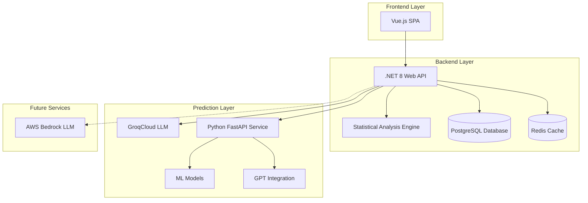

# PredictLottoNZ

A comprehensive full-stack web application for analyzing historical New Zealand lottery data and generating intelligent predictions using statistical analysis, machine learning, and AI-powered predictions with multi-line coverage optimisation.

## 🏗️ Architecture

PredictLottoNZ employs a microservices architecture with five main components:

- **Frontend**: Vue.js 3 single-page application with TypeScript
- **Backend**: .NET 8 Web API with Entity Framework Core
- **Predictor**: Python FastAPI service with ML and GPT integration
- **Database**: PostgreSQL 15 with automated migrations
- **Cache**: Redis 7 for distributed caching and performance optimization



## 📋 Prerequisites

### Required for Docker Deployment

- **Docker**: Version 20.10 or higher
- **Docker Compose**: Version 2.0 or higher

### Required for Local Development

- **.NET SDK**: Version 8.0 or higher

## 📚 API Documentation

The backend API includes comprehensive Swagger/OpenAPI documentation for easy testing and exploration of all available endpoints.

### Accessing Swagger UI

- **Docker Development**: http://localhost:5000/swagger
- **Root Redirect**: In development, visiting the root URL (/) automatically redirects to Swagger
- **Production**: Swagger UI is disabled in production for security reasons

### Features

- **Interactive Testing**: Test all API endpoints directly from the browser (development only)
- **Comprehensive Documentation**: Detailed parameter descriptions and response examples
- **Authentication Support**: Test secured endpoints with JWT tokens
- **Development Environment**: Available only in development mode for security

For detailed API documentation, see [docs/SWAGGER.md](docs/SWAGGER.md)

## 🔍 LangSmith Observability

The project includes LangSmith integration for comprehensive observability and tracing of AI-powered predictions.

### Features

- **Automatic Tracing**: All LLM calls are automatically logged with inputs, outputs, and metadata
- **Performance Monitoring**: Track response times, error rates, and token usage
- **Debugging Tools**: Visual inspection of prediction chains and reasoning steps
- **Feedback Collection**: Track prediction accuracy against actual lottery results
- **Dataset Management**: Store and evaluate test cases

### Quick Setup

1. **Get your LangSmith API key** from [smith.langchain.com](https://smith.langchain.com)
2. **Add to `.env` file**:
   ```env
   LANGCHAIN_TRACING_V2=true
   LANGCHAIN_API_KEY=your_langsmith_api_key
   LANGCHAIN_PROJECT=predict-lotto-nz
   ```
3. **Install dependencies**: `pip install -r predictor/requirements.txt`
4. **View traces**: https://smith.langchain.com

For detailed setup instructions, see:

- [LangSmith Setup Guide](docs/LANGSMITH_SETUP.md)
- [Quick Reference](docs/LANGSMITH_QUICK_REFERENCE.md)
- [Integration Summary](docs/LANGSMITH_INTEGRATION_SUMMARY.md)

- **Node.js**: Version 18 or higher with npm
- **Python**: Version 3.11 or higher with pip
- **PostgreSQL**: Version 15 or higher (optional, can use Docker)

### Optional Services

- **OpenAI API Key**: For GPT-powered predictions
- **AWS Account**: For AWS LLM service integration

## 🚀 Quick Start

### Option 1: Docker Deployment (Recommended)

1. **Clone the repository**

   ```bash
   git clone <repository-url>
   cd predict-lotto-nz
   ```

2. **Configure environment variables**

   ```bash
   cp .env.example .env
   ```

   Edit the `.env` file with your configuration:

   ```env
   # Database Configuration
   POSTGRES_PASSWORD=your_secure_password
   POSTGRES_DB=predict_lotto_nz
   POSTGRES_USER=postgres

   # Service Ports
   BACKEND_PORT=5000
   FRONTEND_PORT=3001
   PREDICTOR_PORT=8000
   POSTGRES_PORT=5434

   # Optional: AI Services
   OPENAI_API_KEY=your_openai_api_key
   AWS_REGION=us-west-2
   AWS_ACCESS_KEY_ID=your_aws_access_key
   AWS_SECRET_ACCESS_KEY=your_aws_secret_key
   ```

3. **Start all services**

   ```bash
   # Production mode
   docker-compose up -d

   # Or development mode with hot reload
   docker-compose -f docker-compose.yml -f docker-compose.dev.yml up -d
   ```

4. **Verify deployment**

   ```bash
   # Test Docker setup
   ./scripts/test-docker.ps1 -HealthCheck

   # Or manually check services
   docker-compose ps
   ```

5. **Access the application**
   - **Frontend**: http://localhost:3001
   - **Backend API**: http://localhost:5000
   - **API Documentation**: http://localhost:5000/swagger
   - **Predictor Service**: http://localhost:8000
   - **Predictor Docs**: http://localhost:8000/docs
   - **Database**: localhost:5434

### Option 2: Local Development Setup

1. **Start PostgreSQL**

   ```bash
   docker-compose up -d postgres
   ```

2. **Backend Setup**

   ```bash
   cd backend
   dotnet restore
   dotnet ef database update
   dotnet run
   ```

3. **Frontend Setup**

   ```bash
   cd frontend
   npm install
   npm run dev
   ```

4. **Predictor Service Setup**
   ```bash
   cd predictor
   pip install -r requirements.txt
   uvicorn main:app --reload --port 8000
   ```

## ⚙️ Environment Variables

### Database Configuration

| Variable            | Required | Default            | Description                  |
| ------------------- | -------- | ------------------ | ---------------------------- |
| `POSTGRES_PASSWORD` | ✅       | -                  | PostgreSQL database password |
| `POSTGRES_DB`       | ❌       | `predict_lotto_nz` | Database name                |
| `POSTGRES_USER`     | ❌       | `postgres`         | Database username            |
| `POSTGRES_PORT`     | ❌       | `5434`             | Database port                |

### Service Ports

| Variable         | Required | Default | Description               |
| ---------------- | -------- | ------- | ------------------------- |
| `BACKEND_PORT`   | ❌       | `5000`  | Backend API port          |
| `FRONTEND_PORT`  | ❌       | `3001`  | Frontend application port |
| `PREDICTOR_PORT` | ❌       | `8000`  | Predictor service port    |

### AI Services (Optional)

| Variable                | Required | Default                          | Description                        |
| ----------------------- | -------- | -------------------------------- | ---------------------------------- |
| `GROQCLOUD_API_KEY`     | ❌       | -                                | GroqCloud API key (primary LLM)    |
| `GROQCLOUD_MODEL`       | ❌       | `llama-3.3-70b-versatile`        | GroqCloud model to use             |
| `GROQCLOUD_BASE_URL`    | ❌       | `https://api.groq.com/openai/v1` | GroqCloud API base URL             |
| `FASTAPI_BASE_URL`      | ❌       | `http://predictor:8000`          | FastAPI predictor service URL      |
| `OPENAI_API_KEY`        | ❌       | -                                | OpenAI API key for GPT predictions |
| `AWS_REGION`            | ❌       | `ap-southeast-2`                 | AWS region for LLM services        |
| `AWS_ACCESS_KEY_ID`     | ❌       | -                                | AWS access key ID                  |
| `AWS_SECRET_ACCESS_KEY` | ❌       | -                                | AWS secret access key              |

### Application Configuration

| Variable                 | Required | Default                 | Description              |
| ------------------------ | -------- | ----------------------- | ------------------------ |
| `ASPNETCORE_ENVIRONMENT` | ❌       | `Development`           | .NET environment         |
| `VUE_APP_API_BASE_URL`   | ❌       | `http://localhost:5000` | Frontend API base URL    |
| `LOG_LEVEL`              | ❌       | `INFO`                  | Python service log level |

## 🛠️ Development

### 📖 Development Mode Documentation

**Important**: Your Docker setup supports two modes:

- **Production Mode** (current): Code changes require rebuild
- **Development Mode** (recommended): Automatic hot-reload

**📚 Complete Guide**: See [DEVELOPMENT_VS_PRODUCTION.md](DEVELOPMENT_VS_PRODUCTION.md) for detailed comparison

### Quick Start - Development Mode

```powershell
# Start with automatic hot-reload (recommended for development)
.\scripts\dev-start.ps1

# View logs
.\scripts\dev-logs.ps1

# Restart a service
.\scripts\dev-restart.ps1 backend
```

### Development Workflow

1. **Start development environment**

   ```bash
   # Start all services in development mode with hot-reload
   docker-compose -f docker-compose.yml -f docker-compose.dev.yml up -d

   # Or use the helper script (Windows)
   .\scripts\dev-start.ps1

   # Or start individual services
   docker-compose up -d postgres  # Database only
   ```

2. **Edit code and see changes automatically**
   - **Backend**: Edit .cs files → Auto-recompiles via `dotnet watch` in ~5-10 seconds
   - **Frontend**: Edit .vue/.ts files → Hot-reload in ~1-2 seconds
   - **Predictor**: Edit .py files → Auto-restarts in ~2-3 seconds

3. **When to rebuild** (only needed for dependency changes)

   ```powershell
   # After adding new packages
   .\scripts\dev-rebuild.ps1 backend   # Added NuGet packages
   .\scripts\dev-rebuild.ps1 frontend  # Added npm packages
   .\scripts\dev-rebuild.ps1 predictor # Added pip packages
   ```

4. **Run services locally for development** (alternative to Docker)

   ```bash
   # Backend with hot reload
   cd backend
   dotnet watch run

   # Frontend with hot reload
   cd frontend
   npm run dev

   # Predictor with hot reload
   cd predictor
   uvicorn main:app --reload --port 8000
   ```

### Testing

#### Backend Tests

```bash
cd backend
dotnet test                           # Run all tests
dotnet test --filter "Category=Unit" # Unit tests only
dotnet test --filter "Category=PBT"  # Property-based tests only
```

#### Frontend Tests

```bash
cd frontend
npm run test          # Run tests in watch mode
npm run test:run      # Run tests once
npm run test:coverage # Run with coverage report
```

#### Predictor Tests

```bash
cd predictor
python -m pytest                    # Run all tests
python -m pytest test_api.py        # Specific test file
python -m pytest -v --tb=short      # Verbose output
```

### Database Management

#### Migrations

```bash
cd backend
dotnet ef migrations add <MigrationName>  # Create migration
dotnet ef database update                 # Apply migrations
dotnet ef database drop                   # Drop database
```

#### Seeding Data

```bash
# Import sample lottery data
curl -X POST -F "file=@sample-data.csv" http://localhost:5000/api/lotto/upload
```

### 📁 Project Structure

```
predict-lotto-nz/
├── backend/                          # .NET Core Web API
│   ├── Controllers/                  # API controllers
│   ├── Services/                     # Business logic services
│   ├── Models/                       # Data models and DTOs
│   ├── Data/                         # Entity Framework context
│   ├── Migrations/                   # Database migrations
│   ├── PredictLottoNZ.Tests/        # Unit and property-based tests
│   ├── Dockerfile                    # Production container
│   ├── Dockerfile.dev                # Development container
│   └── Program.cs                    # Application entry point
├── frontend/                         # Vue.js application
│   ├── src/
│   │   ├── components/               # Vue components
│   │   ├── views/                    # Page components
│   │   ├── services/                 # API services
│   │   ├── stores/                   # Pinia state management
│   │   └── assets/                   # Static assets
│   ├── Dockerfile                    # Production container
│   ├── Dockerfile.dev                # Development container
│   ├── nginx.conf                    # Nginx configuration
│   └── package.json                  # Dependencies and scripts
├── predictor/                        # Python FastAPI service
│   ├── main.py                       # FastAPI application
│   ├── ml_predictor.py               # ML prediction models
│   ├── gpt_predictor.py              # GPT integration
│   ├── blended_predictor.py          # Combined predictions
│   ├── test_*.py                     # Test files
│   ├── Dockerfile                    # Production container
│   ├── Dockerfile.dev                # Development container
│   └── requirements.txt              # Python dependencies
├── scripts/                          # Deployment and utility scripts
│   ├── init-db.sql                   # Database initialization
│   ├── test-docker.ps1               # Docker testing script
│   └── test-docker.sh                # Docker testing script (Linux)
├── .kiro/specs/predict-lotto-nz/     # Feature specifications
│   ├── requirements.md               # System requirements
│   ├── design.md                     # Technical design
│   └── tasks.md                      # Implementation tasks
├── .env                              # Environment variables (create from .env.example)
├── .env.example                      # Environment variables template
├── docker-compose.yml                # Production Docker services
├── docker-compose.dev.yml            # Development overrides
├── Makefile                          # Build and deployment commands
└── README.md                         # This documentation
```

## 🔧 Services

### Backend (.NET 8 Web API)

**Port**: 5000 | **Health Check**: `/api/health`

**Features**:

- CSV file upload and parsing with duplicate detection
- Historical lottery data management (1500+ draws from 2008-present)
- Statistical analysis engine (number gaps, sum distributions, pair co-occurrence, draw patterns)
- Enhanced AI prediction with GroqCloud LLM using statistical context
- Multi-provider prediction chain with availability checks and circuit breakers
- Multi-line coverage optimisation with sum range validation
- Backtesting framework for strategy comparison (enhanced vs random)
- Ticket tracking with auto-verification against draw results
- Prediction accuracy scoring and history tracking
- RESTful API with Swagger documentation
- Entity Framework Core with PostgreSQL
- Redis distributed caching
- Comprehensive logging and error handling

**Key Endpoints**:

- `GET /api/predictions/generate?count=4` - Generate AI predictions
- `GET /api/predictions/stored` - Get stored predictions
- `GET /api/backtest/compare?drawCount=50&linesPerDraw=4` - Compare strategies
- `GET /api/backtest/run?drawCount=50&enhanced=true` - Run single strategy backtest
- `POST /api/ticket` - Add a purchased ticket (auto-checks against draw)
- `GET /api/ticket` - List tracked tickets with results
- `GET /api/ticket/summary` - Performance summary (ROI, match distribution)
- `POST /api/lotto/upload` - Upload lottery CSV files
- `GET /api/lotto/latest` - Get latest lottery draw
- `GET /api/lotto/draws?page=1&pageSize=10` - Paginated draw history
- `GET /api/health` - Health check

### Frontend (Vue.js)

**Port**: 3001 (dev) / 3000 (production) | **Health Check**: `/health`

**Features**:

- Modern Vue 3 with TypeScript and Composition API
- Prediction generation with statistical reasoning display
- Ticket tracker with number highlighting (matched/bonus/powerball)
- Backtest dashboard with strategy comparison visualisation
- File upload with real-time progress tracking
- Responsive design for desktop and mobile
- Toast notifications for user feedback
- Help guide with feature documentation
- State management with Pinia
- Component-based architecture

**Key Pages**:

- `PredictionsView` - Generate and browse AI predictions
- `TicketsView` - Track purchased tickets, view results with colour-coded matches
- `BacktestView` - Run enhanced vs random strategy comparisons
- `DrawsView` - Browse historical draw results
- `LookupView` - Number frequency lookup
- `HelpView` - Feature documentation and usage guide

### Predictor (Python FastAPI)

**Port**: 8000 | **Health Check**: `/health`

**Features**:

- Machine learning prediction models using scikit-learn
- OpenAI GPT integration for AI-powered predictions
- Blended prediction algorithms combining ML and AI
- Automatic model training with historical data
- RESTful API with OpenAPI documentation
- Async request handling for performance

**Key Endpoints**:

- `POST /predict` - Generate predictions
- `POST /train` - Train ML models
- `GET /health` - Health check
- `GET /docs` - API documentation

### Database (PostgreSQL)

**Port**: 5434 | **Health Check**: Built-in

**Features**:

- Stores historical lottery draws with full metadata
- Number combination management with timestamps
- Prediction tracking with source identification
- Data preservation for ML training
- Automated migrations and seeding
- Performance optimized with indexes

### Cache (Redis)

**Port**: 6379 | **Health Check**: `PING` command

**Features**:

- Distributed caching for improved performance
- Session storage and temporary data
- Frequency analysis result caching
- Prediction result caching
- Automatic cache invalidation
- Memory-efficient data structures
- Persistence with append-only file (AOF)

## 📚 API Documentation

### Interactive API Documentation

Once services are running, comprehensive API documentation is available:

- **Backend API**: http://localhost:5000/swagger
  - Swagger UI with interactive endpoint testing
  - Complete request/response schemas
  - Authentication and error handling examples

- **Predictor API**: http://localhost:8000/docs
  - FastAPI automatic documentation
  - Request validation and examples
  - Model schemas and response formats

### Key API Endpoints

#### Lottery Data Management

```http
# Upload lottery CSV file
POST /api/lotto/upload
Content-Type: multipart/form-data
Body: file (CSV file)

# Check if draw exists
GET /api/lotto/exists/{drawNumber}
Response: { "exists": boolean }

# Get latest draw
GET /api/lotto/latest
Response: LottoDrawDto
```

#### Prediction Management

```http
# Upload number combinations
POST /api/combinations/upload
Content-Type: multipart/form-data
Body: file (CSV/TXT/PDF file)

# Get predictions
GET /api/combinations/predictions?count=5
Response: PredictionResult[]

# Generate predictions (Predictor service)
POST /predict
Content-Type: application/json
Body: { "weekly_numbers": [1, 2, 3, 4, 5, 6] }
```

## 🏥 Health Checks and Monitoring

### Health Check Endpoints

All services include comprehensive health checks:

| Service   | Endpoint       | Port | Status             |
| --------- | -------------- | ---- | ------------------ |
| Backend   | `/api/health`  | 5000 | Application health |
| Frontend  | `/health`      | 3001 | Nginx status       |
| Predictor | `/health`      | 8000 | Service health     |
| Database  | Built-in       | 5434 | PostgreSQL ready   |
| Redis     | `PING` command | 6379 | Cache availability |

### Monitoring Commands

```bash
# Check all service health
./scripts/test-docker.ps1 -HealthCheck

# View service status
docker-compose ps

# View service logs
docker-compose logs [service-name]

# Monitor resource usage
docker stats
```

## 🔧 Deployment

### Local Deployment

```bash
# Production deployment
docker-compose up -d

# Development deployment with hot reload
docker-compose -f docker-compose.yml -f docker-compose.dev.yml up -d
```

### Cloud Deployment

#### AWS Deployment

1. **Set up AWS credentials**

   ```bash
   export AWS_ACCESS_KEY_ID=your_access_key
   export AWS_SECRET_ACCESS_KEY=your_secret_key
   export AWS_REGION=us-west-2
   ```

2. **Deploy using Docker Compose**

   ```bash
   # Update environment variables for cloud
   cp .env.example .env.production
   # Edit .env.production with cloud-specific values

   # Deploy
   docker-compose --env-file .env.production up -d
   ```

#### Azure Deployment

1. **Configure Azure Container Instances**

   ```bash
   # Set Azure credentials
   az login

   # Create resource group
   az group create --name predict-lotto-rg --location eastus

   # Deploy container group
   az container create --resource-group predict-lotto-rg \
     --file docker-compose.yml
   ```

### Production Considerations

#### Security

- Change default passwords in production
- Use secrets management for API keys
- Enable HTTPS with SSL certificates
- Configure firewall rules for database access
- Use non-root users in containers

#### Performance

- Configure database connection pooling
- Set up Redis for caching (optional)
- Use CDN for static assets
- Configure load balancing for high availability

#### Monitoring

- Set up application logging
- Configure health check monitoring
- Use container orchestration (Kubernetes)
- Implement backup strategies

## 🐛 Troubleshooting

### Quick Links

- **System Status**: See `SYSTEM_STATUS.md` for current service status
- **Docker Build Issues**: See `DOCKER_FIX_SUMMARY.md` for recent fixes
- **Quick Fix Guide**: See `DOCKER_QUICK_FIX.md` for common solutions
- **Detailed Troubleshooting**: See `docs/DOCKER_TROUBLESHOOTING.md`

### Helper Scripts (Windows)

```powershell
# Verify all services are healthy
.\scripts\verify-services.ps1

# Start database only (quick access)
.\scripts\start-db-only.ps1

# Rebuild predictor service
.\scripts\rebuild-predictor.ps1

# Full rebuild with cache clearing
.\scripts\docker-rebuild.ps1
```

### Common Issues

#### Docker Build Hanging

If the Docker build hangs on package downloads:

```powershell
# Use the rebuild script (includes fixes)
.\scripts\docker-rebuild.ps1

# Or manually rebuild with no cache
docker-compose build --no-cache predictor
```

See `DOCKER_FIX_SUMMARY.md` for details on the recent pydantic version conflict fix.

#### Port Conflicts

```bash
# Check which ports are in use (Windows)
netstat -ano | Select-String ":3001"
netstat -ano | Select-String ":5000"
netstat -ano | Select-String ":8000"
netstat -ano | Select-String ":5434"
```

#### Database Connection Issues

```bash
# Check PostgreSQL container status
docker-compose ps postgres

# View PostgreSQL logs
docker-compose logs postgres

# Connect to database manually
docker-compose exec postgres psql -U postgres -d predict_lotto_nz

# Or use the quick script
.\scripts\start-db-only.ps1
```

#### Service Startup Issues

```bash
# Check service health
curl http://localhost:5000/api/health
curl http://localhost:8000/health
curl http://localhost:3001

# Or use the verification script
.\scripts\verify-services.ps1

# Restart specific service
docker-compose restart backend
docker-compose restart predictor
docker-compose restart frontend
```

#### Environment Variable Issues

```bash
# Verify environment variables are loaded
docker-compose config

# Check specific service environment
docker-compose exec backend env | grep POSTGRES
docker-compose exec predictor env | grep OPENAI
```

### Debugging Commands

#### View Logs

```bash
# All services
docker-compose logs -f

# Specific service
docker-compose logs -f backend
docker-compose logs -f predictor
docker-compose logs -f frontend

# Last 100 lines
docker-compose logs --tail=100 backend
```

#### Container Inspection

```bash
# List running containers
docker ps

# Inspect container
docker inspect predict-lotto-backend

# Execute commands in container
docker-compose exec backend bash
docker-compose exec predictor bash
```

#### Database Debugging

```bash
# Connect to database
docker-compose exec postgres psql -U postgres -d predict_lotto_nz

# Check database tables
\dt

# View recent lottery draws
SELECT * FROM "LottoDraws" ORDER BY "Date" DESC LIMIT 5;

# Check predictions
SELECT * FROM "Predictions" ORDER BY "CreatedAt" DESC LIMIT 10;
```

### Reset and Clean Up

#### Reset Database

```bash
# Stop services and remove volumes
docker-compose down -v

# Start fresh
docker-compose up -d postgres

# Apply migrations
docker-compose exec backend dotnet ef database update
```

#### Clean Docker Environment

```bash
# Remove all containers and images
docker-compose down --rmi all

# Remove unused Docker resources
docker system prune -a

# Rebuild everything
docker-compose build --no-cache
docker-compose up -d
```

## 🧪 Testing

### Running Tests

#### Backend Tests (.NET)

```bash
cd backend
dotnet test                                    # All tests
dotnet test --filter "Category=Unit"          # Unit tests only
dotnet test --filter "Category=PBT"           # Property-based tests
dotnet test --logger "console;verbosity=detailed"  # Verbose output
```

#### Frontend Tests (Vue.js)

```bash
cd frontend
npm run test                    # Interactive test runner
npm run test:run               # Single test run
npm run test:coverage          # With coverage report
```

#### Predictor Tests (Python)

```bash
cd predictor
python -m pytest                              # All tests
python -m pytest test_api.py                  # Specific file
python -m pytest -v --tb=short               # Verbose with short traceback
python -m pytest --cov=. --cov-report=html   # Coverage report
```

### Test Categories

#### Property-Based Tests (PBT)

The system includes comprehensive property-based tests that verify correctness properties:

- **CSV Parsing**: Validates data extraction and transformation
- **Duplicate Detection**: Ensures data integrity during imports
- **Prediction Generation**: Verifies prediction algorithms
- **File Format Parsing**: Tests multi-format file handling
- **Database Operations**: Validates data persistence

#### Unit Tests

Traditional unit tests cover:

- Individual service methods
- Controller endpoints
- Component behavior
- Error handling scenarios

#### Integration Tests

End-to-end tests verify:

- Complete user workflows
- Service communication
- Database transactions
- File upload processes

## 📊 Usage Examples

### Uploading Lottery Data

1. Navigate to http://localhost:3001
2. Click "Upload CSV File"
3. Select a Powerball NZ CSV file
4. Monitor upload progress
5. View import results (records added/skipped)

### Generating Predictions

1. Upload historical lottery data (optional)
2. Click "Generate Predictions"
3. Select number of predictions (1-10)
4. View predictions with sources:
   - Frequency-based predictions
   - ML model predictions
   - GPT-powered predictions

### API Usage Examples

#### Upload CSV File

```bash
curl -X POST \
  -F "file=@powerball-data.csv" \
  http://localhost:5000/api/lotto/upload
```

#### Get Predictions

```bash
curl -X GET \
  "http://localhost:5000/api/combinations/predictions?count=5" \
  -H "Accept: application/json"
```

#### Generate AI Predictions

```bash
curl -X POST \
  -H "Content-Type: application/json" \
  -d '{"weekly_numbers": [5, 12, 18, 20, 33, 40]}' \
  http://localhost:8000/predict
```

## 🤝 Contributing

We welcome contributions! Please follow these guidelines:

### Development Process

1. **Fork the repository**

   ```bash
   git clone https://github.com/your-username/predict-lotto-nz.git
   cd predict-lotto-nz
   ```

2. **Create a feature branch**

   ```bash
   git checkout -b feature/your-feature-name
   ```

3. **Set up development environment**

   ```bash
   docker-compose -f docker-compose.yml -f docker-compose.dev.yml up -d
   ```

4. **Make your changes**
   - Follow existing code style and patterns
   - Add tests for new functionality
   - Update documentation as needed

5. **Run tests**

   ```bash
   # Backend tests
   cd backend && dotnet test

   # Frontend tests
   cd frontend && npm run test:run

   # Predictor tests
   cd predictor && python -m pytest
   ```

6. **Submit a pull request**
   - Provide clear description of changes
   - Reference any related issues
   - Ensure all tests pass

### Code Style Guidelines

#### .NET Backend

- Follow Microsoft C# coding conventions
- Use async/await for I/O operations
- Implement proper error handling
- Add XML documentation for public APIs

#### Vue.js Frontend

- Use TypeScript for type safety
- Follow Vue 3 Composition API patterns
- Use Pinia for state management
- Implement proper component props validation

#### Python Predictor

- Follow PEP 8 style guidelines
- Use type hints for function signatures
- Implement proper async patterns
- Add docstrings for all functions

### Testing Requirements

- All new features must include tests
- Property-based tests for core algorithms
- Unit tests for individual components
- Integration tests for API endpoints

## 📄 License

This project is licensed under the MIT License - see the [LICENSE](LICENSE) file for details.

## 🙏 Acknowledgments

- **New Zealand Lotteries Commission** for lottery data format specifications
- **OpenAI** for GPT API integration
- **FastAPI** and **Vue.js** communities for excellent frameworks
- **Property-Based Testing** community for correctness verification approaches

## 📞 Support

For support and questions:

1. **Check the documentation** in this README
2. **Search existing issues** on GitHub
3. **Create a new issue** with detailed information:
   - Environment details (OS, Docker version)
   - Steps to reproduce the problem
   - Expected vs actual behavior
   - Relevant logs and error messages

## 🔄 Changelog

### Version 1.1.0 (Current)

- Statistical analysis engine (number gaps, sum distributions, pair co-occurrence)
- Enhanced GroqCloud LLM prediction with full statistical context
- Multi-line coverage optimisation with sum range validation (P10-P90)
- Backtesting framework with enhanced vs random strategy comparison
- Ticket tracking with auto-verification against draw results
- Provider availability checks (IsAvailableAsync) to prevent timeouts
- Frontend: Ticket Tracker page with colour-coded number matching
- Frontend: Backtest Dashboard with comparison table and distribution charts
- Frontend: Help Guide with feature documentation
- Fixed Docker hot-reload (WORKDIR alignment with volume mount)
- Added FASTAPI_BASE_URL to docker-compose for proper service discovery

### Version 1.0.0

- Initial release with full-stack architecture
- CSV file upload and parsing
- Frequency-based predictions
- ML and GPT integration via FastAPI
- Multi-provider prediction chain with circuit breakers
- Docker containerization with dev/production modes
- Comprehensive property-based testing suite
- Redis distributed caching
- Prediction accuracy tracking

### Planned Features

- AWS Bedrock LLM integration (provider registered, not yet implemented)
- Ensemble scoring (generate many candidates, pick best statistically)
- Temperature/model tuning experiments
- Automated CSV import from Lottolyzer
- Mobile-responsive ticket entry
- Cloud deployment automation (AWS ECS)
